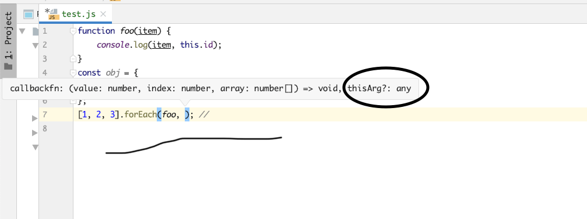

## this关键字
 首先要明确的一点事，this是在运行时绑定的，并不是编译阶段绑定的。一个函数被调用时，会创建一个活动记录，也称之为
 执行上下文，执行上下文中包括函数的调用栈，调用方法，参数以及this，this是其中的一个属性，会在函数执行过程中用到。

为什么要使用this？this提供了一种优雅的 对象隐式绑定的方法，可以让你写的函数更加通用，更加易于复用。对于负责的应用程序，显式
传递上下文对象会让程序边的越来越混乱，越来越无法维护，因为this会自动引用合适的上下文对象，非常重要的。

### 函数调用栈
也就是上边说的函数执行上下文中的函数调用栈，要理解函数的this指向，首先需要明白函数的调用栈，例：
```javascript
function bar() {
    console.log('bar');
    foo();
}
function foo() {
    console.log('foo');
    baz();
}
function baz() {
    console.log('baz');
}
bar();
```
上述函数调用栈过程，其中还包括变量的声明，以及函数执行上下文的说明。


右侧窗口，Call Stack 为函数调用栈，Scope 下 Local 为当前函数的执行上下文，包括当前组用于下的变量声明，以及this的指向，包括函数
返回阶段的return值。

### this的绑定规则
通过上边的gif可以看到三个函数执行过程中this都是指向widow对象。是如何确定的呢？

首先你需要找到函数的调用栈，然后根据一定的规则来判断得出当前函数执行过程中的this指向，规则有四条，而且有一定的优先级顺序。

#### 默认绑定
当函数独立调用，是没有办法应用其他的this绑定规则的，因此就是默认的规则。
```javascript
function foo() {
    console.log(this.a);
}
var a = 10;
foo(); // 打印出的结果是 10
```
上述代码，函数直接调用，没有其他的修饰符，因此只能是this的默认绑定模式，foo函数执行，执行上下文中的this的指向是全局对象window，
而后我们有声明了全局变量a，并且赋值为10。在JavaScript严格模式下，会阻止函数调用栈this默认指向全局对象，也就是阻止默认绑定，
例如下边代码：
```javascript
function foo() {
    'use strict';
    console.log(this.a);
}
var a = 10;
foo(); // TypeError: this is undefined
```

#### 隐式绑定
隐式绑定是看函数的调用位置是否有上下文对象，或者说某个对象是否拥有或者和包含当前的函数。
```javascript
function hello() {
    console.log(this.name);
}
const obj = {
    name: '123',
    hello,
}
obj.hello(); // 123
```
在JavaScript中函数即为对象，而对于复杂数据结构而言，赋值操作都是基于引用，不是值传递，而是引用传递。因此上边代码中不论是
先声明hello函数在赋值给obj对象，还是直接在声明obj对象的时候对其中一个属性直接进行函数声明，理论上obj与hello函数都是基于引用的。
但是上边代码中我们执行方式 obj.hello() 是通过访问obj对象来访问函数并且执行的，因此函数的执行上下文中的this执行就是当前的obj对象。

因此基于上述的描述，看下边的代码：
```javascript
function hello() {
    console.log(this.name);
}
const obj1 = {
    name: 'obj1',
    hello,
}
const obj2 = {
    name: 'obj2',
    obj1,
}
obj2.obj1.hello(); // obj1
```
像这种跨层级的调用，hello函数的执行上下文只会关注最后一层，的确包含hello函数的也只有 obj1。

由于隐式绑定中很关键的一点是函数调用的入口，如果是从一个对象的属性引用找到当前函数的，则会将this隐式绑定到对象上，但是一旦函数
执行的调用入口不是通过对象的引入找到函数并执行的，则会发生 "隐式丢失" ，丢失之后会使用默认绑定规则。很不幸的是，隐式丢失在
实际的JavaScript编程中很容易发生。
```javascript
function hello() {
    console.log(this.name);
}
const obj = {
    name: '123',
    hello,
};
var name = 'global name';
const target = obj.hello; // 函数别名
target(); // global name
```
上边代码之所以打印全局的name变量，就是因为target的赋值操作实际上是基于引用的，target变量也指向了函数hello，因此target()
实际上就是函数的直接调用。除了上边代码中写的情况，回调函数同样可以导致 隐式丢失。
```javascript
function foo() {
    console.log(this.name);
}
const obj = {
    name: 'obj',
    foo,
};
var name = 'global name';
function doFoo(fn) {
    fn();
}
doFoo(obj.foo); // global name
setTimeout(obj.foo, 0); // global name
```
上边代码分别通过回调函数以及定时的方式调用函数foo，回调函数参数传值跟变量赋值是一样的，因此doFoo函数中fn的执行事实上就是
foo函数的执行，因此执行上下文中this指向的window。

setTimeout 定时器执行，事实上也是通过函数传参形式设置定时器的，因此也是基于引用传递了foo函数，同样考虑到定时器中的回调
会涉及到浏览器的事件循环，是一个宏任务，因此宏任务执行的时候只是执行foo函数。

#### 显示绑定

上边提到的隐式绑定，必须在一个对象内包含一个指向函数的属性，并通过该属性间接访问函数并执行，从而将this隐式的绑定到这个对象上。

JavaScript函数的原型上有两个方法，call, apply来实现this的显示绑定，这两个函数所实现的效果是一致的，不同点在于函数签名，
这两个函数的第一个参数是你想要绑定的对象，第一个参数的值可以是任意值，不仅仅是对象；
call的后续参数可以依次罗列参数，apply的第二个参数是一个数组，没有后续的参数。
```javascript
function foo() {
    console.log(this.name);
}
const obj = {
    name: '123',
};
foo.call(obj); // 123
```
上边也提到了，第一个参数绑定对象可以是任意值，如果是一个基础数据类型（字符串、bool）的话，会将基础数据类型转成对象格式，
也就是隐式的调用实例化方法（new String(...), new Boolean()）。这种现象通常叫做 "装箱"
```javascript
function myToUp() {
    console.log(this.toUpperCase());
}
myToUp.call('name'); // NAME
```

##### 硬绑定
上边说的显示绑定是能解决 "丢失绑定的问题"，看下边代码：
```javascript
function plus(num) {
    console.log(this.num, num);
    return this.num + num;
}
const obj = {
    num: 2,
};
const bindPlus = function() {
    return plus.apply(obj, arguments);
};
console.log(bindPlus(3)); // 5
```
上边代码，我们执行的bindPlus函数，不论是如何调用执行的，最终都会执行apply的代码，每次执行都会手动绑定obj对象，因此不会
发生丢失现象。事实是我们可以将bindPlus这个函数公共化一下：
```javascript
function plus(num) {
    console.log(this.num, num);
    return this.num + num;
}
const obj = {
    num: 2,
};
// 公共硬绑定函数
function bind(obj, fn) {
    return function() {
        return fn.apply(obj, arguments);
    }
}
const bindPlus = bind(obj, plus);
console.log(bindPlus(3)); // 5
```
因为这种需求非常常见，因此JavaScript中提供了内置的bind方法，Function.prototype.bind。

##### API调用的 "上下文"
很多第三方库中的函数以及JavaScript中内置的原生函数都提供了可选参数，这个参数通常称之为 "上下文"，作用跟使用bind是一样的，
保证回调函数可以使用指定的，正确的this。看下边代码
```javascript
function foo(item) {
    console.log(item, this.id);
}
const obj = {
    id: 'context'
};
[1, 2, 3].forEach(foo, obj); // 1 context 2 context 3 context
```
下图为forEach函数的签名：


#### new关键字绑定
首先说明一下，JavaScript中的new关键字跟其他面向对象语言中的new 其实不是一回事。JavaScript中没有类的概念。

然后再说一下 "构造函数"，构造函数不是一种特殊的函数，跟普通的函数，我们自定义的函数没有什么区别。
new关键字可以调用函数，可以称之为 "构造调用"，因此构造调用的函数也就是构造函数。

构造调用，跟普通的函数执行调用还是有不同的，区别在一下四点：
- 会创建 或者说构造一个全新的对象。
- 这个对象的原型会执行[[原型]]连接（obj.__proto__ = fn.prototype）
- 这个新的对象会绑定到构造函数调用的this
- 如果构造函数有返回值，并且返回值是一个对象，则返回构造函数的返回值，否则返回新构造的对象。

```javascript
function foo(a) {
    this.a = a;
}
const bar = new foo(2);
console.log(bar.a); // 2
```

### this绑定规则优先级
首先先明确优先级顺序依次为：
1. 默认绑定
2. 隐式绑定
3. 显示绑定
4. new关键字绑定
这里只着重说一下显示绑定以及new 关键字的优先级顺序。首先apply 跟 call函数执行之后不会返回一个函数，因此无法进行
构造调用，因此没办法验证，但是bind函数会返回一个函数，是可以构造调用的，因此可以用bind做一个比较。

思考我们之前自己实现的 硬绑定 公共函数：
```javascript
function bind(obj, fn) {
    return function() {
        return fn.apply(obj, arguments);
    }
}
```
再看下边例子：
```javascript
function foo(a) {
    this.a = a;
}
const obj = {};
var bar = foo.bind(obj);
bar(2);
console.log(obj.a); // 2
const baz = new bar(3);
console.log(obj.a); // 2
console.log(baz.a); // 3
```
上边的结果证明了实例化之后的结果跟 obj没有关系，因此可以推导出实例化new关键字的优先级大于显示绑定。
首先需要明确的是 "构造调用" 跟普通函数调用的差别之处，参考上文提到的。事实上JavaScript内置的bind函数比我们
自己实现的要复杂很多，可以参考MDN提供的一种bind polyfill
```javascript
Function.prototype.bind = function(oThis) {
    if (typeof this !== "function") { // 与 ECMAScript 5 最接近的 // 内部 IsCallable 函数
        throw new TypeError("Function.prototype.bind - what is trying " + "to be bound is not callable");
    }
    var aArgs = Array.prototype.slice.call( arguments, 1 );
    var fToBind = this;
    var fNOP = function(){};
    var fBound = function() {
        return fToBind.apply(
            (
                this instanceof fNOP &&
                oThis ? this : oThis
            ),
            aArgs.concat(Array.prototype.slice.call( arguments ))
        )
    };
    fNOP.prototype = this.prototype;
    fBound.prototype = new fNOP();
    return fBound;
};
```
分析一下这个函数。首先最后的返回值是fBound这个函数，分两种情况来看：
- 正常调用

正常调用情况下，首先明确this的指向，可以参考前三种this绑定规则，这三种规则中都不会涉及到实例化操作，因此this instanceof fNOP
的值肯定是false，所以导致fToBind.apply 执行的对象就是我们bind的对象也即是oThis。

- 构造调用

构造调用情况下，参考上边提到的new关键字绑定中说的四点区别，第二点为原型连接，因此当前函数执行的this就是fBound的实例，同时
看到有语句 fBound.prototype = new fNOP(),因此 this instanceof fNOP的为TRUE。

上边的例子中也看到了，bind之后的返回的函数还是可以构造调用的，也是符合我们的预期的，不会影响到bind的对象，除此之外，这种
编码方式还有其他的好处，首先bind 会将除第一个参数之外的其他参数都传递到被绑定的函数，因此可以实现参数的预先设置，
我们称之为 "参数预制" 或者叫 "部分应用" 这是 "柯力化" 的一种。看下边例子：
```javascript
function foo(arg1, arg2) {
    this.total = arg1 + arg2;
}
const bar = foo.bind(null, 10);
const instance = new bar(5);
console.log(instance.total); // 15
```

### 绑定的其他情况

上述this绑定的四种规则，有时会失效。
#### 被忽略的this
```javascript
function foo() {
    console.log(this.a);
}
var a = 2;
foo.call(null); // 2
```
事实上 如果把 null undefined 作为this绑定对象传入到call apply 或者bind 时，实际上this绑定规则是默认规则，所以
是全局的变量 a。

但是很多情况下我们会有用到apply来 "展开" 一个数组，或者使用bind实现 柯力化（预先设置一些参数）都会绑定this为null
```javascript
function foo(a, b) {
    console.log(a, b);
}
foo.apply(null, [1, 3]); // 1, 3
foo.bind(null, 1)(2); // 1, 2
```
可以通过Object.create(null) 来创造一个空对象，作为this的绑定。

#### 间接引用
另一个需要注意的是，你可能有意或者无意的创建一个函数的 "间接引用" 在这种情况下，函数调用活应用默认绑定规则。
```javascript
function foo() {
    console.log(this.a);
}
var a = 2;
var obj = {
    a: 3,
    foo,
}
var p = {
    a: 4,
}
obj.foo(); // 3
(p.foo = obj.foo)(); // 2
```
上边代码中赋值语句的返回值是目标函数的引用，也就是foo函数，因此应用了默认绑定。

#### 箭头函数

ES6引入了箭头函数，箭头函数可以绑定当前函数词法作用下的this，如果当前箭头函数是类的一个方法，则箭头函数所获取到的this就是
这个类的实例，如果这个箭头函数定义在一个函数中，则this就是外包裹函数执行上下文的this指向。
```javascript
class Foo {
    constructor() {
        this.name = 'name';
    }
    sayName = () => {
        console.log(this.name);
    }
    sayNameNormal() {
        console.log(this.name);
    }
}
const instance = new Foo();
const { sayName, sayNameNormal } = instance;
sayName(); // name
sayNameNormal(); // TypeError: Cannot read property 'name' of undefined
```
上述代码说明，如果通过引用直接获取到sayNameNormal 然后执行的话，this不是Instance。而sayName则正确绑定着this。
